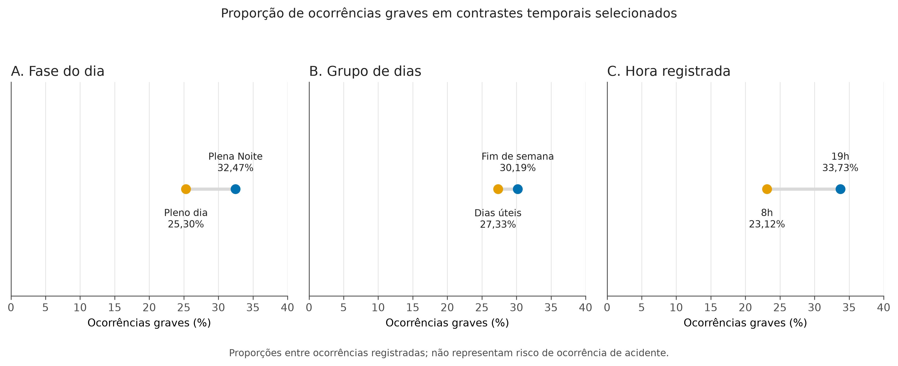
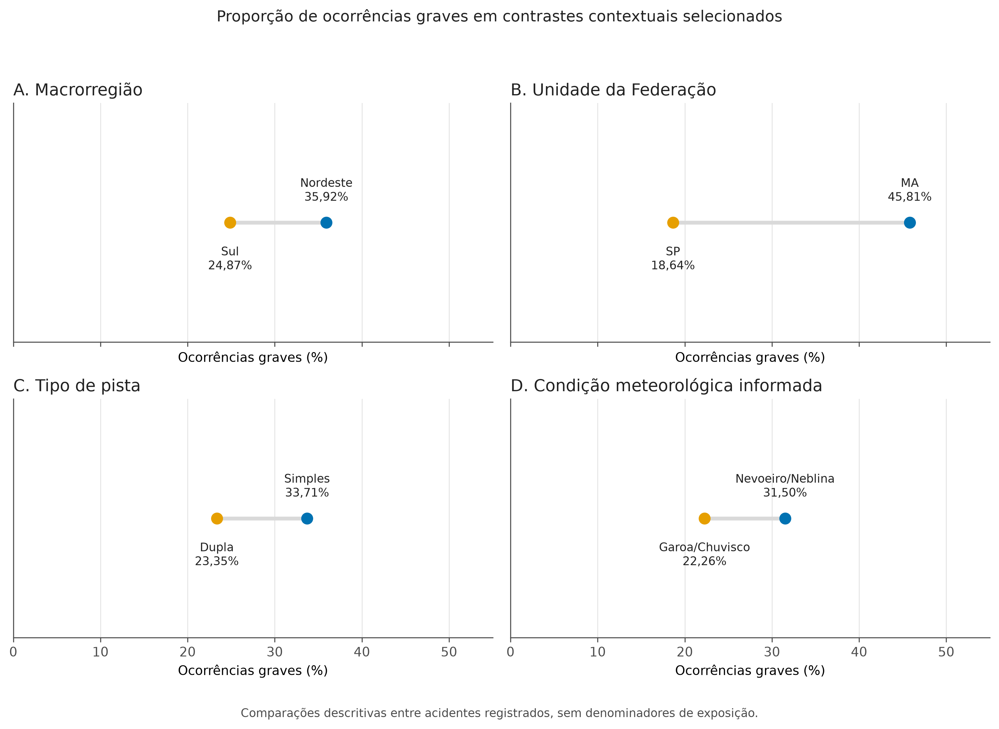
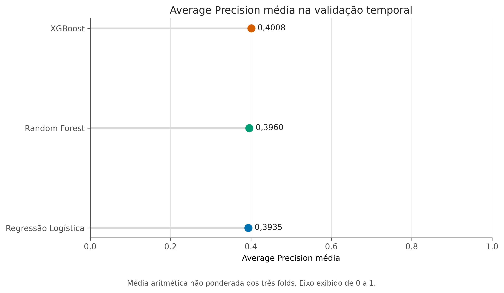
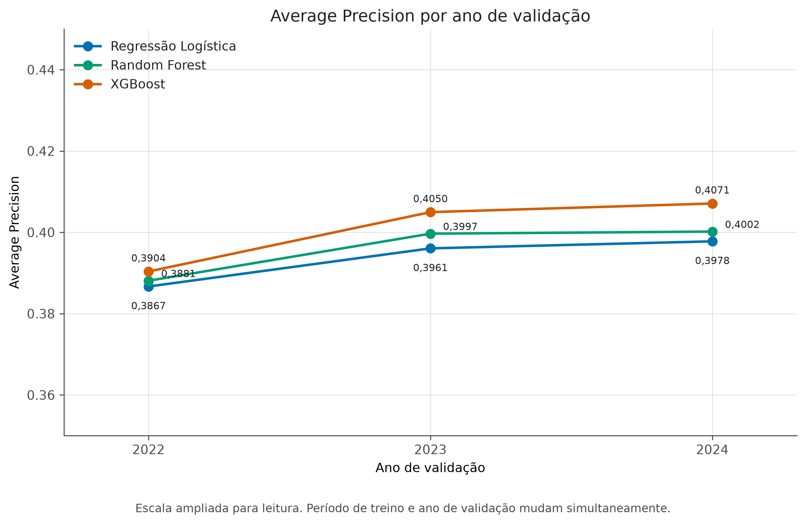
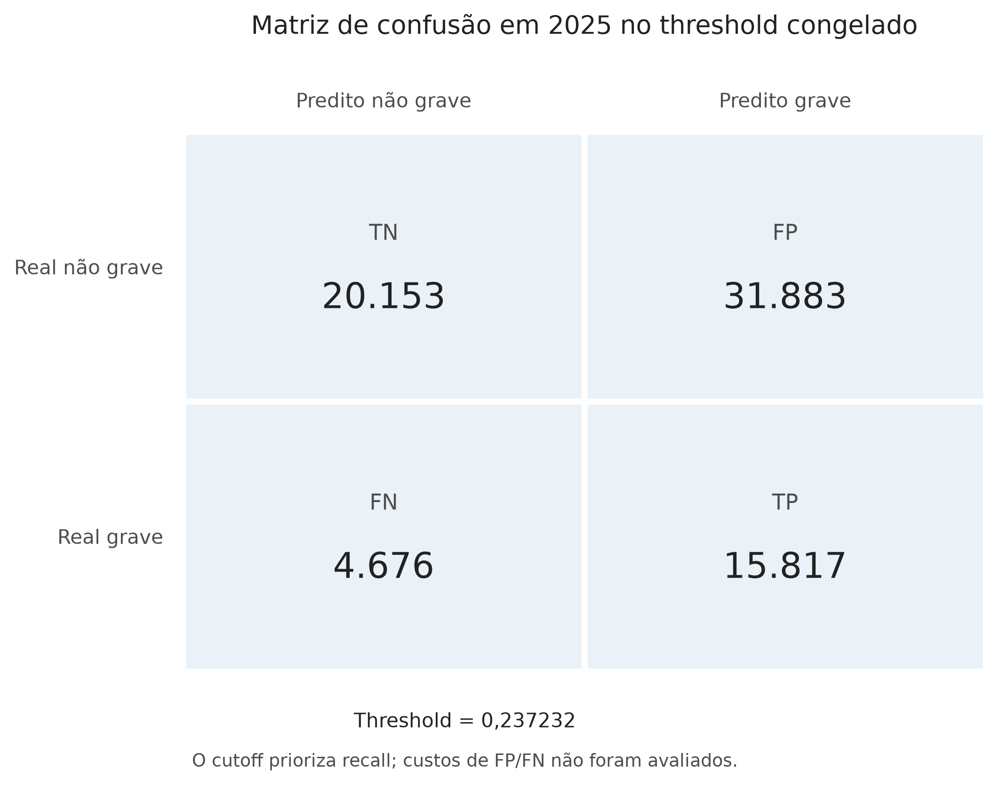
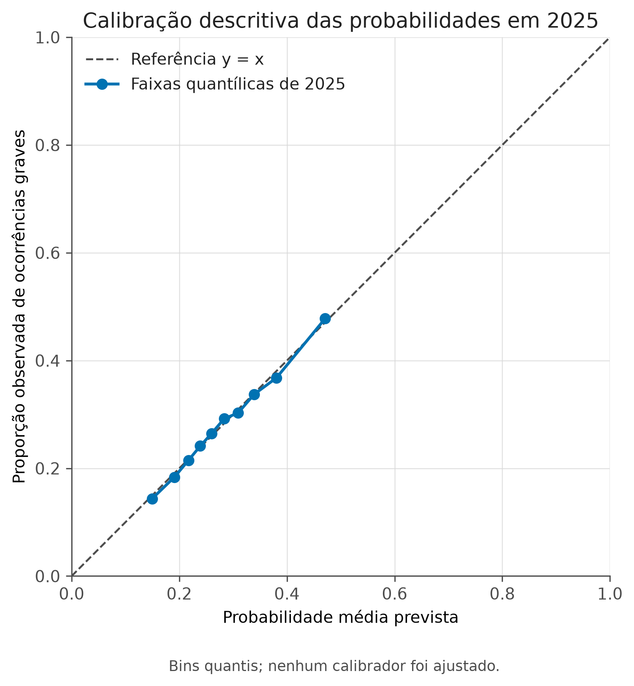
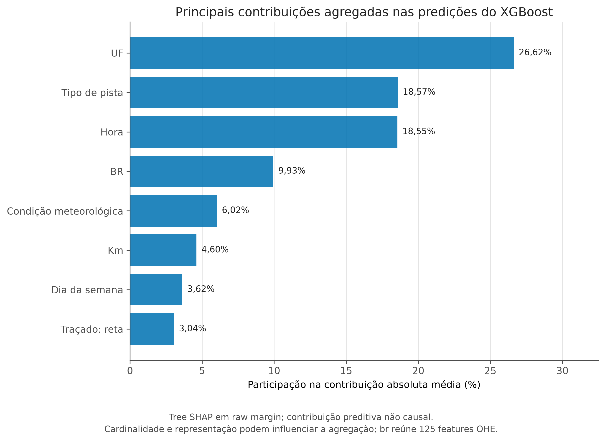

# Resultados e Discussão — versão revisada

> Versão revisada na Fase 5F a partir do texto aprovado da Fase 5E.2. A revisão preserva os
> resultados e as fontes científicas congeladas. A aprovação humana e a numeração definitiva
> dos elementos visuais permanecem pendentes até a integração do manuscrito completo.

# 4. Resultados

## 4.1 Caracterização da população analisada

A população analisada compreendeu 342.624 ocorrências registradas pela Polícia Rodoviária
Federal entre 2021 e 2025. O desfecho binário de gravidade (`target_grave`) foi definido no
nível da ocorrência pela presença de ao menos uma morte ou de ao menos um ferido grave. Foram
identificadas 96.857 ocorrências graves e 245.767 não graves, o que corresponde a uma
prevalência global da classe grave de 28,27%. O universo empírico abrange, portanto, acidentes
registrados na base pública, e não o conjunto de deslocamentos realizados na malha federal.

A Tabela 1 mostra que as prevalências anuais variaram entre 28,06% e 28,49%. Essa pequena
amplitude permite descrever a composição anual do desfecho como aproximadamente constante no
período, sem constituir teste de estabilidade estatística. Como o volume anual de registros
também variou, contagens e prevalências são apresentadas separadamente.

<!-- internal_id: T1 -->

**Tabela 1 — Caracterização anual da população de ocorrências**

| Ano | Ocorrências | Graves | Não graves | Prevalência grave (%) |
|---|---:|---:|---:|---:|
| 2021 | 64.567 | 18.118 | 46.449 | 28,0608 |
| 2022 | 64.606 | 18.409 | 46.197 | 28,4943 |
| 2023 | 67.766 | 19.212 | 48.554 | 28,3505 |
| 2024 | 73.156 | 20.625 | 52.531 | 28,1932 |
| 2025 | 72.529 | 20.493 | 52.036 | 28,2549 |
| **Total** | **342.624** | **96.857** | **245.767** | **28,2692** |

*Fonte: elaboração própria com base nos dados da PRF.*

## 4.2 Associações descritivas com gravidade

A RQ1 foi examinada por contrastes univariados entre categorias das dimensões temporais,
geográficas, viárias e meteorológicas. As comparações descrevem a proporção de ocorrências
graves em cada contexto registrado. Não incorporam denominadores de circulação, controle
multivariado ou identificação de mecanismos causais.

### 4.2.1 Padrões temporais e de calendário

Os contrastes temporais selecionados apresentaram diferenças na proporção de ocorrências
graves. Em Plena Noite, essa proporção foi de 32,47%, ante 25,30% em Pleno dia, diferença de
7,17 pontos percentuais. Nos fins de semana, observou-se 30,19%, em comparação com 27,33% nos
dias úteis. Na dimensão horária, 19h apresentou 33,73%, enquanto 8h apresentou 23,12%.

A Figura 1 preserva cada contraste em um painel próprio. Assim, as seis categorias não compõem
uma ordenação conjunta: fase do dia, grupo de dias e hora registrada representam recortes
distintos e parcialmente relacionados. Os resultados evidenciam heterogeneidade temporal
entre os registros, mas não isolam o efeito de cada marcador de calendário nem incorporam o
volume de circulação.

<!-- internal_id: F1 -->

### 4.2.2 Padrões geográficos, viários e meteorológicos

Também foram observadas diferenças entre contextos geográficos, viários e meteorológicos. A
proporção de ocorrências graves foi de 35,92% no Nordeste e de 24,87% no Sul. Entre os extremos
estaduais selecionados, Maranhão e São Paulo apresentaram, respectivamente, 45,81% e 18,64%.
Quanto ao tipo de pista, a categoria Simples registrou 33,71%, e a categoria Dupla, 23,35%.
Entre condições meteorológicas informadas e com ao menos 500 ocorrências, os valores foram de
31,50% para Nevoeiro/Neblina e 22,26% para Garoa/Chuvisco.

A Figura 2 organiza essas comparações em facetas distintas, sem formar um ranking comum entre
macrorregião, unidade federativa, pista e meteorologia. A categoria meteorológica Ignorado
permanece nas tabelas completas como registro de informação ausente, mas não integra o
contraste substantivo. Sem exposição e diante de diferenças de composição entre categorias,
as proporções não constituem medidas de segurança territorial, viária ou meteorológica.

<!-- internal_id: F2 -->

### 4.2.3 Tipo e causa registrados

Tipo e causa registrados produziram os maiores contrastes selecionados na síntese descritiva.
Para tipo, Atropelamento de Pedestre versus Colisão traseira apresentou diferença de 44,35
pontos percentuais. Para causa, Pedestre andava na pista versus Reação tardia ou ineficiente do
condutor apresentou diferença de 51,48 pontos percentuais. Os valores integrais e as categorias
comparadas permanecem no Apêndice A4.

Essas variáveis foram preservadas na caracterização dos dados, mas não incorporadas ao
conjunto preditivo principal. Seus campos podem ser conhecidos ou consolidados após o momento
preditivo assumido, e suas taxonomias mudaram entre períodos. A análise descritiva e a
modelagem mantêm, assim, papéis distintos no estudo.

## 4.3 Desenho preditivo e comparação dos modelos

Regressão Logística, Random Forest e XGBoost foram avaliados nos mesmos três folds temporais.
A Average Precision (AP) foi calculada em cada validação e agregada por média aritmética não
ponderada. As médias foram de 0,3935 para Regressão Logística, 0,3960 para Random Forest e
0,4008 para XGBoost. A Figura 3 apresenta essa ordenação segundo a regra de comparação
previamente definida.

As diferenças médias foram pequenas em termos absolutos: 0,0025 entre Random Forest e
Regressão Logística, 0,0073 entre XGBoost e Regressão Logística e 0,0048 entre XGBoost e Random
Forest. O XGBoost obteve a maior AP média e foi selecionado conforme a regra especificada, com
incremento modesto. A comparação abrange três folds e não recebeu teste post hoc.

<!-- internal_id: F4 -->

## 4.4 Consistência na validação temporal

Nos folds com janela de treinamento expansiva, as validações corresponderam sucessivamente a
2022, 2023 e 2024, sempre com treinamento restrito aos anos anteriores. O XGBoost apresentou
AP de 0,3904, 0,4050 e 0,4071 e ocupou a primeira posição nos três folds. As três famílias
apresentaram APs mais elevadas nos folds posteriores, sem queda abrupta ou colapso de
generalização no intervalo observado.

Essa sequência não isola uma variação atribuível ao ano, pois o período e o volume de
treinamento crescem ao mesmo tempo que muda o ano de validação. Os valores, portanto, não
demonstram tendência temporal de melhora. A Figura 4 reúne os nove resultados e permite
observar a ordenação e a dispersão entre validações, sem privilegiar o melhor fold isolado.

<!-- internal_id: F5 -->

## 4.5 Capacidade preditiva e avaliação final em 2025

Após a seleção interna e o ajuste final em 2021–2024, o modelo foi avaliado nas ocorrências de
2025. A AP foi de 0,3974, a ROC-AUC de 0,6286 e o Brier score de 0,1938. No limiar de decisão
previamente definido, a precisão positiva (precision) foi de 0,3316, a sensibilidade (recall)
de 0,7718 e o F1 de 0,4639. AP e ROC-AUC caracterizam capacidade discriminativa moderada, e o
Brier complementa essa avaliação com uma medida do erro probabilístico.

Em relação às referências de desenvolvimento, os deltas foram de −0,0034 para AP, −0,0023
para ROC-AUC e aproximadamente −0,00008 para Brier. A Tabela 2 mostra também que as métricas no
limiar ficaram próximas das observadas nas predições out-of-fold (OOF) temporais. O ano de 2025
não foi usado para selecionar modelo ou limiar, nem para alterar o ajuste final. Entretanto,
havia participado da análise exploratória e da auditoria de drift estrutural, não sendo
completamente cego do ponto de vista estrutural.

<!-- internal_id: T2 -->

**Tabela 2 — Avaliação temporal final em 2025**

| Métrica | Referência de desenvolvimento | 2025 | Δ 2025 − referência | Referência utilizada |
|---|---:|---:|---:|---|
| Average Precision | 0,4008 | 0,3974 | −0,0034 | Média interna dos folds |
| ROC-AUC | 0,6308 | 0,6286 | −0,0023 | Média interna dos folds |
| Brier score | 0,1939 | 0,1938 | −0,0001 | Média interna; menor é melhor |
| Precisão positiva (Precision) | 0,3333 | 0,3316 | −0,0017 | OOF temporal no limiar definido |
| Sensibilidade (Recall) | 0,7705 | 0,7718 | +0,0014 | OOF temporal no limiar definido |
| F1 | 0,4653 | 0,4639 | −0,0014 | OOF temporal no limiar definido |

*Fonte: elaboração própria com base nos dados da PRF.*

## 4.6 Comportamento do limiar de decisão

O limiar de 0,237232 foi selecionado exclusivamente nas predições OOF temporais de 2022, 2023
e 2024, mediante maximização do F1 para a classe grave. Aplicado sem alteração em 2025,
produziu 20.153 verdadeiros negativos, 31.883 falsos positivos, 4.676 falsos negativos e
15.817 verdadeiros positivos. A Figura 5 apresenta as decisões resultantes desse ponto de
operação.

A sensibilidade de 77,18% indica que a maior parte das ocorrências graves foi classificada
como positiva. A precisão positiva de 33,16% mostra, por sua vez, que parcela substancial dos
alertas positivos correspondeu a ocorrências não graves. O F1 de 0,4639 sintetiza o compromisso
entre precisão positiva e sensibilidade. Esse compromisso decorre da regra matemática de
seleção; custos de erro, capacidade de atendimento e utilidade institucional não foram
avaliados, e o limiar não constitui recomendação de uso.

<!-- internal_id: F6 -->

## 4.7 Diagnósticos complementares

### 4.7.1 Calibração descritiva em 2025

As probabilidades de 2025 foram organizadas em dez faixas quantílicas. Em cada faixa, a média
predita foi comparada à proporção grave observada. A Figura 6 apresenta essas relações e a
referência `y = x`, complementando as métricas globais sem alterar as previsões do modelo.

O diagnóstico é descritivo: nenhum calibrador foi ajustado e as faixas não constituem novo
teste de desempenho. A figura registra a relação entre previsão média e frequência observada
nos agrupamentos publicados, sem sustentar julgamento categórico de calibração nem reabrir a
avaliação final.

<!-- internal_id: F7 -->

### 4.7.2 Contribuição agregada das variáveis preditoras

A interpretação pós-avaliação por Tree SHAP, em escala de margem bruta (`raw margin`), colocou
UF, Tipo de pista, Hora, BR e Condição meteorológica nas cinco primeiras posições do ranking
agregado. A Figura 7 apresenta as oito variáveis preditoras líderes por contribuição absoluta
média, preservando a ordenação publicada.

O agrupamento considerou a variável de origem, de modo que BR agrega 125 colunas resultantes de
codificação one-hot. As contribuições descrevem o comportamento preditivo do modelo e dependem
da representação, da cardinalidade, das interações e das redundâncias. O ranking não identifica
mecanismos causais nem determina a seleção futura de variáveis. Com esse diagnóstico, encerra-se
a apresentação dos resultados internos que fundamentam a discussão.

<!-- internal_id: F8 -->

# 5. Discussão

## 5.1 Heterogeneidade da gravidade entre ocorrências registradas

Os resultados respondem à RQ1 ao mostrar que a proporção de ocorrências graves não se
distribuiu uniformemente entre os contextos registrados. Contrastes temporais, geográficos,
viários e meteorológicos apresentaram magnitudes distintas, enquanto tipo e causa exibiram
diferenças maiores sob cautelas adicionais. Esses achados podem ser contextualizados por
estudos de gravidade rodoviária com diferentes populações, formulações e métodos estatísticos
ou de aprendizado de máquina (Iranitalab; Khattak, 2017; Sameen; Pradhan, 2017; Komol et al.,
2021).

No contexto brasileiro, Franceschi et al. (2022) analisaram a gravidade em rodovias federais
com definição, período e modelo próprios. A proximidade temática permite diálogo com uma
aplicação nacional, mas não torna seus coeficientes ou conclusões diretamente comparáveis aos
contrastes deste estudo. Aqui, as diferenças provêm de análises univariadas da população
registrada, e não de estimativas ajustadas de associação com a gravidade.

A interpretação deve separar volume, proporção condicional e oportunidade de exposição.
Chapman (1973) discute a importância da definição das oportunidades de exposição na mensuração
da segurança viária. Como a base não inclui fluxo veicular, veículo-quilômetro, número de
viagens, população exposta ou tempo sob cada condição, as proporções descrevem a composição dos
acidentes registrados, sem quantificar acidentes fora desse conjunto condicionado.

## 5.2 O que as características conseguem prever

A RQ2 foi respondida pela presença de sinal preditivo moderado. Em 2025, a AP ficou acima da
prevalência da classe positiva e a ROC-AUC permaneceu próxima de 0,63, indicando que as
variáveis autorizadas contêm informação para ordenar parcialmente ocorrências graves e não
graves. A separação é imperfeita, como evidencia a combinação de precisão positiva mais baixa
e sensibilidade mais alta no limiar previamente definido.

A adoção da AP como métrica primária dirige a atenção à classe positiva, menos frequente neste
problema. Curvas ROC e Precision–Recall ocupam espaços relacionados, mas distintos (Davis;
Goadrich, 2006), e a visualização Precision–Recall pode ser informativa em dados desbalanceados
(Saito; Rehmsmeier, 2015). A definição operacional de AP permanece a do contrato experimental,
sem implicar preferência universal em relação à ROC-AUC.

Discriminação e calibração são propriedades diferentes das previsões probabilísticas (Van
Calster et al., 2019). O Brier score complementa as métricas de ordenação ao quantificar o erro
quadrático probabilístico (Brier, 1950), enquanto a Figura 6 inspeciona de forma agrupada a
relação entre probabilidades e frequências observadas. Esses diagnósticos devem ser lidos sob a
premissa metodológica de compatibilidade das variáveis com o momento preditivo, pois o conjunto
público não informa quando cada campo é preenchido no fluxo interno da PRF.

## 5.3 Complexidade dos modelos e ganhos modestos

A RQ3 mostra que a complexidade adicional não produziu ampla mudança de capacidade
discriminativa. A Random Forest combina árvores por agregação (Breiman, 2001), enquanto o
XGBoost implementa boosting de árvores regularizado e escalável (Chen; Guestrin, 2016). Tais
mecanismos representam não linearidades e interações ausentes em uma especificação linear
simples, mas as referências fundadoras descrevem os métodos e não antecipam qual família deve
liderar neste conjunto de dados.

No experimento, o XGBoost alcançou a maior AP em cada fold e a maior média, seguido por Random
Forest e Regressão Logística. A pequena distância entre as famílias indica que, neste desenho,
a flexibilidade adicional dos modelos de árvores produziu incremento limitado em AP. Estudos
comparativos também mostram que a ordenação entre famílias depende da população, do desfecho,
das variáveis e da validação adotada (Iranitalab; Khattak, 2017; Komol et al., 2021).

A seleção do XGBoost é válida para a regra definida, mas não constitui afirmação geral sobre
ensembles. O resultado está condicionado ao período de 2021–2024, às 22 variáveis físicas, ao
pré-processamento, às configurações fixas e à AP média não ponderada. Sem busca ampla de
hiperparâmetros ou inferência sobre os deltas, trata-se de liderança interna com ganho modesto.

## 5.4 Consistência temporal e generalização

A validação respeitou a direção do tempo: cada conjunto de validação sucedeu os dados usados
no respectivo treinamento. Esse princípio é relevante quando as observações apresentam
estrutura temporal e o interesse recai sobre desempenho futuro (Roberts et al., 2017). Nos
resultados, não houve queda abrupta entre os três folds, e o XGBoost preservou a primeira
posição em 2022, 2023 e 2024.

As APs mais elevadas nos folds posteriores não isolam evolução temporal. A janela de
treinamento cresce entre as validações enquanto o ano avaliado também muda. A sequência é,
portanto, compatível com diferentes combinações de quantidade de treino e composição anual,
sem permitir atribuição exclusiva a qualquer uma delas. Três folds fornecem evidência
descritiva limitada e não demonstram invariância do desempenho.

Em 2025, AP, ROC-AUC, Brier e as métricas no limiar permaneceram próximas das referências
internas, respondendo à RQ5 por manutenção aproximada em período posterior. Ainda assim,
mudanças entre distribuições de desenvolvimento e aplicação podem afetar a generalização
(Moreno-Torres et al., 2012), e um único ano final não representa variações futuras. O período
foi protegido da seleção preditiva, embora já tivesse sido observado em análises exploratórias
e de drift estrutural.

## 5.5 Limiar de decisão, sensibilidade e falsos positivos

O limiar converte escores contínuos em decisões binárias e trata de questão distinta da
ordenação probabilística. Diferentes pontos de operação alteram a relação entre precisão
positiva e sensibilidade e podem envolver custos de erro distintos (Davis; Goadrich, 2006;
Fawcett, 2006). No ponto definido, a sensibilidade de aproximadamente 77% foi acompanhada de
precisão positiva de aproximadamente 33% e de 31.883 falsos positivos.

A maximização do F1 possui regra matemática própria para selecionar o limiar (Lipton; Elkan;
Naryanaswamy, 2014). Neste estudo, ela foi aplicada apenas às predições OOF temporais, com
critérios de desempate definidos antes da avaliação final. O comportamento semelhante em 2025
reproduz descritivamente esse compromisso, mas não converte o ótimo da métrica em ótimo
operacional.

Uma decisão de implantação exigiria informações ausentes deste estudo, como custos relativos
de falsos positivos e falsos negativos, capacidade de resposta, benefício operacional e
impacto institucional. Assim, não se pode concluir que o ponto selecionado maximize utilidade
para a PRF. O resultado explicita o volume de erros associado à regra experimental e mostra por
que a sensibilidade não deve ser interpretada isoladamente.

## 5.6 Relação entre análise descritiva e interpretação do XGBoost

Há convergência parcial entre os contrastes descritivos e o ranking pós-avaliação. Unidade
federativa, tipo de pista, hora e condição meteorológica apresentaram heterogeneidade na
análise descritiva e figuraram entre as variáveis de maior contribuição absoluta agregada. A
aproximação indica que o XGBoost utilizou informações das mesmas dimensões empíricas, sem
reproduzir diretamente os contrastes univariados.

SHAP representa predições por atribuições aditivas de contribuição (Lundberg; Lee, 2017), e
Tree SHAP permite agregar explicações locais em descrições globais de modelos de árvore
(Lundberg et al., 2020). Neste estudo, as contribuições foram calculadas em margem e agregadas
por variável de origem. Interações, não linearidades, redundância, composição, codificação
one-hot e cardinalidades distintas podem contribuir para que a ordenação multivariada divirja
da amplitude dos contrastes descritivos.

As atribuições permanecem vinculadas ao comportamento do modelo, não ao processo gerador dos
dados. A relevância quantificada por valores de Shapley envolve escolhas distributivas e
questões causais não resolvidas pela explicação preditiva (Janzing; Minorics; Blöbaum, 2020), e
seu uso como medida geral de importância possui limitações conceituais (Kumar et al., 2020).
Assim, a Figura 7 sustenta a interpretação do XGBoost avaliado, sem transformar contribuições
agregadas em determinantes da gravidade.

## 5.7 Limitações

A primeira limitação decorre da população e da mensuração. O estudo abrange apenas acidentes
registrados pela PRF e não dispõe de denominadores de exposição; volumes e proporções ficam,
portanto, condicionados aos registros. O desenho observacional não separa efeitos de
composição, contexto, registro e variáveis omitidas. A literatura aplicada contextualiza o
problema, mas não substitui a evidência interna nem atribui mecanismos às associações.

A segunda limitação pertence ao desenho preditivo. A disponibilidade das variáveis no momento
definido é premissa de compatibilidade conceitual, pois não há registros temporais do
preenchimento por campo nem auditoria do fluxo operacional da PRF. Há apenas três folds
internos e um ano de avaliação final, e período de treino e ano de validação mudam
simultaneamente. Mudanças futuras de população, taxonomia ou registro podem deslocar as
distribuições, enquanto 2025 não foi completamente cego às análises estruturais.

A terceira limitação envolve modelo e decisão. A discriminação foi moderada, o ganho do
XGBoost foi pequeno e o limiar produziu muitos falsos positivos. Não foram incorporados custos
de erro, capacidade institucional ou avaliação prospectiva. O procedimento fornece evidência
experimental sobre a distinção entre ocorrências registradas, mas não constitui ferramenta
validada para uso operacional.

A quarta limitação diz respeito à interpretação. Tree SHAP foi aplicado após a avaliação, em
escala de margem, e a agregação por variável depende da representação e da cardinalidade. A
contribuição de BR, por exemplo, reúne 125 colunas one-hot e não é diretamente comparável à de
uma variável numérica representada por uma coluna. Esses resumos descrevem o modelo e não
fornecem identificação causal, ainda que dialoguem com heterogeneidades descritivas.

## 5.8 Síntese da discussão

Em conjunto, os resultados respondem à pergunta principal e às cinco RQs. Entre acidentes
registrados, observou-se heterogeneidade temporal, geográfica, viária e meteorológica; as
variáveis selecionadas forneceram sinal preditivo moderado; e o XGBoost obteve a maior AP sob
validação temporal, com pequena vantagem absoluta sobre Random Forest e Regressão Logística.
Não houve colapso nos folds, e a avaliação de 2025 permaneceu próxima das referências internas
sem participar da seleção ou do ajuste do modelo.

O alcance dessas respostas é limitado pela ausência de exposição, pelo caráter observacional e
pelas fronteiras do desenho preditivo. O limiar favoreceu a sensibilidade ao custo de muitos
falsos positivos, e a interpretação por SHAP descreveu contribuições preditivas, sem alcance
causal. A evidência sustenta a compreensão científica de associações e da capacidade de
classificação entre registros, mas não autoriza recomendação operacional nem substitui a
Conclusão formal do trabalho.
